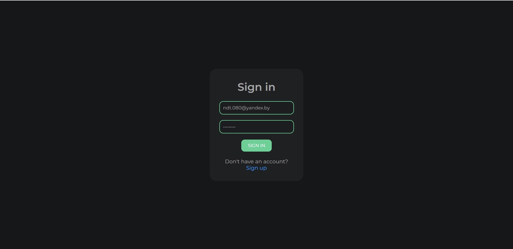
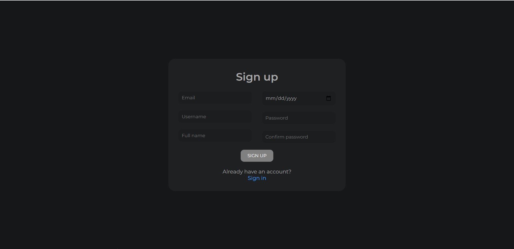
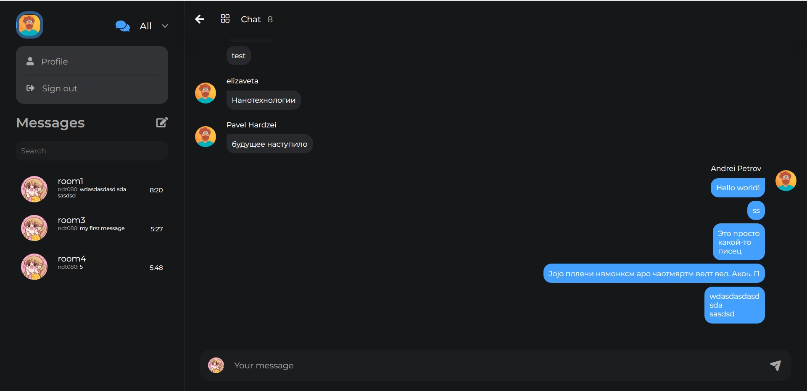
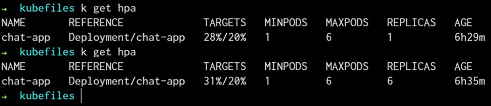

# Messenger

## Demo and OpenApi
> <a href="https://hotfire-chat.web.app/">Messanger.Frontend</a>  
> <a href="https://fakemessenger.herokuapp.com/swagger/">Messanger.Backend</a>  
> <a href="https://chat-app.c-2181e3e.kyma.ondemand.com//swagger/">Messanger.Backend (Cluster)</a>

### Задача:
1. Спроектировать под микросервисную архитектуру чат (систему обмена короткими сообщениями) с сохранением и архивированием истории переписки и другой обычной функциональностью. 
2. Реализовать спроектированную распределенную систему, используя микросервисы, контейнеризацию, базы данных (или базу данных), синхронное и асинхронное взаимодействие на основе сообщений.
3. Продемонстрировать возможности использования программных платформы для кластеризации контейнеров, оркестрации и планирования (Kubernetes, Служба Azure Kubernetes (AKS) или другие).
4. Предусмотреть возможность масштабирования микросервисов (микросервиса) при росте заявок на обслуживание. Эмулировать поток заявок и продемонстрировать эффект масштабирования.

## Messanger.Frontend
Frontend часть Messenger написана с использованием javascript фреймворка VueJS 3 (Typescript) с поддержкой технологии PWA.
Обращение к api веб-сервера для получения данных из базы и системы авторизации, предоставляющей токены доступа, происходит посредством протокола HTTP/HTTPS через http клиент Axios. Обмен сообщениям между пользователями в реальном времени происходит посредством установки постоянного соединения по протоколу Websocket.
Приложение развернуто на платформе Firebase Hosting.

|  |  |
|:---------------------------------------------------------:|:----------------------------------------------------------:|
|  |                                                            |

## Messanger.Backend
Серверная часть Messenger написана с использованием высокоуровневого веб-фреймворка Django на языка программирования Python.   
Для реализации RESTful API был использован framework Django REST. Поддержка веб сокетов осуществлена с помощью Django Channels, а в качестве сервера приложения, основанного на спецификации ASGI (Asynchronous Server Gateway Interface), взят сервер Daphne. Также в связке с Django Channels для передачи сообщений использовался Redis.
В качестве веб-сервера используется Nginx.

Для тестирования приложения используется модуль pytest. При инициализации входных данных для тестов используется модуль factory-boy, а для тестирования веб сокетов - pytest-asyncio.

## Kubernetes
Для управления контейнеризованным серверным приложением был использован оркестратор Kubernetes. 

Минимальным объектом Kubernetes является под (Pod), который представляет собой набор контейнеров.

Для деплоя backend-сервера был использован объект Kubernetes Deployment (более высокоуровневая абстракция над подом), сконфигурированный с помощью yaml манифеста, поды которого представляют собой контейнер с веб-сервером.
Для публикации использовался объект Kubernetes Service, представляющий объект Deployment в сети кластера.

В качестве базы данных была использована PostgreSQL, также представленная в виде контейнера, помещенного в кластер Kubernetes с помощью объекта StatefulSet.

Для автоматического масштабирования сервиса был использован объект Kubernetes HorizontalPodAutoscaler, который выполняет скейлинг сервисов по результатам переданной метрики.

Эмуляция потока заявок выполняется с помощью утилиты loadtest, а также кастомных скриптов, позволяющих отправлять заданное количество запросов по заданному адресу.

Пример масштабирования подов:

