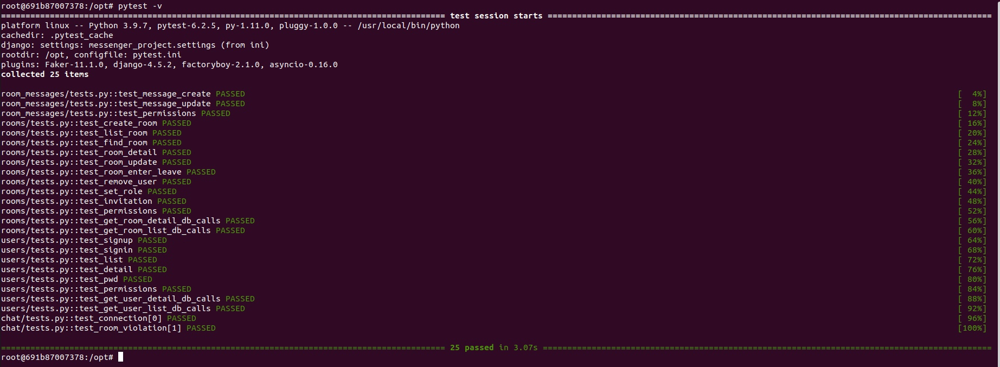

# DarkTalk messenger

## Demo and OpenApi
> <a href="https://hotfire-chat.web.app/">Messenger.Frontend</a>  
> <a href="https://fakemessenger.herokuapp.com/swagger/">Messenger.Backend</a>  

Frontend часть Messenger написана с использованием javascript фреймворка VueJS 3 (Typescript) с поддержкой технологии PWA.
Обращение к api веб-сервера для получения данных из базы и системы авторизации, предоставляющей токены доступа, происходит посредством протокола HTTP/HTTPS через http клиент Axios. Обмен сообщениям между пользователями в реальном времени происходит посредством установки постоянного соединения по протоколу Websocket.
Приложение развернуто на платформе Firebase Hosting.

|  |  |
|:---------------------------------------------------------:|:----------------------------------------------------------:|
|  |                                                            |

## Messenger.Backend
Серверная часть Messenger написана с использованием высокоуровневого веб-фреймворка Django на языка программирования Python.   
Для реализации RESTful API был использован framework Django REST. Поддержка веб сокетов осуществлена с помощью Django Channels, а в качестве сервера приложения, основанного на спецификации ASGI (Asynchronous Server Gateway Interface), взят сервер Daphne. Также в связке с Django Channels для передачи сообщений использовался Redis.
В качестве веб-сервера используется Nginx.

Для тестирования приложения используется модуль pytest. При инициализации входных данных для тестов используется модуль factory-boy, а для тестирования веб сокетов - pytest-asyncio.

